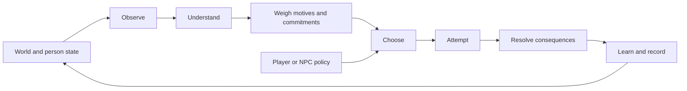

# Human Framework

A reusable simulation of situated human action and development, grounded in Islam with a **Sunni, Hanafi–Maturidi starting point**, informed by empirical research, and explicit about the difference between revelation, interpretation, evidence and engineering choices.

**2026-09-07 · Mobile release (engine 0.1.0):** a working local laboratory and headless kernel, with four playable scenarios, deterministic replay, a simpler comparison policy, five targeted ablations and a reproducible benchmark. No LLM or API key is required. Play and local simulation need no package installation or build step; public deployment uses pinned Wrangler tooling. The numerical mechanisms are authored and uncalibrated; this is not a validated whole-human model.

## Play

**[Play at human.adamwhite.work](https://human.adamwhite.work).** Start with Solo Repair for one-person choices without social effects. The current run is loaded automatically; choose an action card or delegate with Auto round. General model notes are in one collapsed section.

[Plain-language roadmap and evidence map](docs/roadmap.md) · [Private source repository](https://github.com/adam0white/human-framework) · [Deployment workflow](docs/deployment.md)

For optional local development:

Requires Node.js 22 or later and a modern browser. From this directory:

```sh
npm start
```

Open [the optional local laboratory](http://127.0.0.1:4173). Choose a person and an action, or let both people decide with **Auto round**. **Run to end** plays out the current policy. Inspect the recorded reasons and consequences; switch to **Researcher** to see hidden conditions and random draws. Model settings apply when starting a new run. Export a replay to preserve the scenario, settings and choices, then import it to reconstruct the run.

| Small world | Decisions it exposes |
|---|---|
| Courier Crossing | Investigate uncertain conditions, choose a risky or careful contribution, manage fatigue, keep an announced promise |
| Repair Bench | Allocate scarce time between work, rest, food and task practice |
| Water Commons | Maintain a shared resource against consumption, prepare assistance and keep commitments |
| Solo Repair | Work, inspect, rest and practice alone; no promises, peers, assistance or relationship effects |

The original three remain configurations of the same two-person cooperative resource-production structure; Solo Repair isolates the personal processes with one actor. Their illustrations do not implement navigation, repair physics or hydrology. They test reuse of one kernel and provide inspectable choices; broader genre reuse remains to be demonstrated.

## The central loop



Every decision records these seven phases. The person's accessible view is separate from the world's hidden state. A player can override the ranking; an attempted action can fail; a failed task can still yield task-specific practice. Intention is stored separately from outcome and is never parsed to manufacture an effect. The history is an audit log, not yet a model of autobiographical memory.

This is an engineering loop, not an anatomy of the soul or a model of divine decree. Religious source distinctions guide the architecture and its boundaries; the MVP contains no fiqh evaluator, piety meter, spiritual-health score or calculation of divine acceptance. [Islamic foundations](research/islamic-foundations.md) preserves the positive theological treatment and attribution behind those boundaries.

## Run and extend

```sh
npm test
npm run simulate -- courier --seed 7
npm run simulate -- workshop --seed 31 --policy baseline --json artifacts/my-replay.json
npm run benchmark -- --seeds 100 --start-seed 101 --json artifacts/benchmark.json
```

```js
import {createSimulation, getView, rankActions, step, exportReplay, replay} from './src/core/index.js';
import {getScenario} from './src/scenarios/index.js';

const start = createSimulation(getScenario('courier'), {seed: 7});
const view = getView(start, 'amina');
const alternatives = rankActions(view, {modules: {body: false}});
const next = step(start, {
  type: 'act', actorId: 'amina', actionId: 'observe',
  intention: 'Seek better evidence'
});
const restored = replay(exportReplay(next));
```

The ranking override only inspects an alternative policy; it does not mutate the run. Actor order is stable and serial within each round. Replay reconstructs the run from its embedded scenario and commands when the engine version matches; incompatible versions are rejected. Replays include hidden setup and are experiment artifacts, not spoiler-free saves. Runtime modules are in `src/core`, data presets in `src/scenarios`, and the browser adapter in `web`. Add a scenario by composing supported action kinds; a genuinely new mechanism needs an explicit model change and validation.

## What the experiments found

Across 100 paired seeds, full-loop mean progress versus the static baseline was **16.40 vs 15.99** for Courier, **13.71 vs 16.17** for Repair, and **11.80 vs 13.72** for Commons. Courier's progress difference was inconclusive under the descriptive interval; the richer policy lost on the objective in the other two settings. It also ended with less fatigue and more fulfilled promises. Those are different outcomes, not evidence that one policy is universally more human. In the added Solo Repair control, mean progress was 7.38 for full and 8.37 for baseline; disabling promises or relationships made no difference.

All **400 structural null pairs** matched exactly in the expanded benchmark. Automated tests pass, and browser QA covered manual/automatic play, privacy, settings, replay and narrow-screen operation. These verify this software. No human-behavior calibration or theological certification has been performed. See the [benchmark report](docs/benchmark-report.md) for uncertainty, confounds and negative findings, and the [MVP verification record](docs/mvp-status.md) for actual checks and remaining limitations.

## Research and model records

| Document | Purpose |
|---|---|
| [Model reference](docs/model-reference.md) | Implemented equations, units, parameter status, update order and API boundaries |
| [Coverage ledger](docs/coverage-ledger.md) | Implemented proxies, missing faculties, deferred modules and next discriminating experiments |
| [MVP specification](docs/mvp-spec.md) | Accepted scope and concrete contracts |
| [Historical source audit](research/historical-source-audit.md) | All 63 bibliography entries from the two historical reports, targeted verification and 32 mechanism decisions |
| [Historical source inventory](research/historical-sources.json) | Machine-readable provenance, access status and source hashes; 46 entries remain unchecked leads |
| [Prior art](research/prior-art-mvp.md) | The Sims, Versu, social and cognitive architectures, adaptive information, pacing and macro-model boundaries |
| [Experiment design](research/mvp-experiment-design.md) | Independent tests aimed at rejecting unhelpful complexity |
| [Framework proposal](docs/framework-proposal.md) | The broader research direction; proposed faculties are not all implemented |
| [Empirical models](research/empirical-models.md) | Scientific candidates and competing explanations |
| [Architecture alternatives](research/architecture-alternatives.md) | Alternative computational approaches and rejection experiments |
| [Source method](research/source-method.md) | Claim types, interpretation and evidence admission |
| [Earlier research review](docs/review-record.md) | Corrections to the initial synthesis, before implementation |

The historical reports are evidence to examine. Their instructions, coefficient tables and “production-ready” title do not govern this implementation. User-authored aims are kept distinct from inherited LLM proposals. The project remains small enough to inspect and to replace mechanisms when a better model earns its place.
