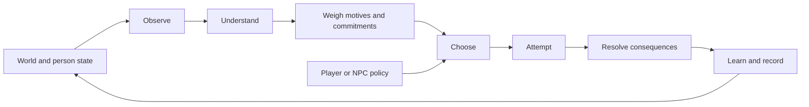

# Human Framework

A simulation laboratory developing reusable components for situated human action and development, grounded in Islam with a **Sunni, Hanafi–Maturidi starting point**, informed by empirical research, and explicit about the difference between revelation, interpretation, evidence and engineering choices.

**2026-09-07 · Release candidate 0.3.0:** the four laboratory scenarios now have explicit goal value, deadline-aware Full scoring and an all-actor planned-simple comparison. A separate game, **Before departure**, embeds a smaller human component to test objects, prerequisites, interruptions and save/resume. Release verification is in progress; this README does not confirm a production deployment. No LLM or API key is required. Play and local simulation need no package installation or build step; public deployment uses a static asset allowlist and pinned Wrangler tooling.

**Direction and external review:** three fresh internal reviewers and two separate Claude CLI processes requested with `--model fable` examined overlapping architecture, scientific and product questions. The [internal synthesis](docs/post-mvp-review.md) and [external review verification](research/reviews/2026-09-07-claude-fable-verification.md) preserve agreements, mistakes, disagreements and provenance. The external reviews examined frozen commit `08aab97`, before the present implementation; they are not a review of the finished candidate.

## Play

**[Play at human.adamwhite.work](https://human.adamwhite.work).** Start with Solo Repair for one-person choices without social effects. The current run is loaded automatically; choose an action card or delegate with Auto round. General model notes are in one collapsed section.

The candidate adds **[Before departure](https://human.adamwhite.work/workshop/)** at `/workshop/`: restore a water pump before departure, moving between storage and the pump room, carrying a wrench and choosing a patch or replacement seal. Work takes simulated time and can be interrupted. A completed repair still needs a test run. This route's production availability awaits release verification; it can also be opened locally at `/workshop/`.

[Plain-language roadmap and evidence map](docs/roadmap.md) · [What is rejected or deferred](research/decision-status.md) · [Private source repository](https://github.com/adam0white/human-framework) · [Deployment workflow](docs/deployment.md)

For optional local development:

Requires Node.js 22 or later and a modern browser. From this directory:

```sh
npm start
```

Open [the optional local laboratory](http://127.0.0.1:4173). Choose a person and an action, or delegate with **Auto round**. **Run to end** plays out the current policy. Inspect the reasons and consequences; switch to **Researcher** for hidden conditions and random draws. Settings apply to a new run. Export a replay to preserve setup and choices, then import it to reconstruct the run.

Each preset allows 36 rounds of 20 simulated minutes. In Solo, one feasible example is to eat at observed hunger 60% when food remains, rest at fatigue 65%, and otherwise choose careful work. Seed 7 completes in 29 rounds with two failed repairs, six rests and two meals. This is an example, not an optimal or universally guaranteed strategy; faster successful strategies can use fewer meals.

| Small world | Decisions it exposes |
|---|---|
| Courier Crossing | Investigate uncertain conditions, choose a risky or careful contribution, manage fatigue, keep an announced promise |
| Repair Bench | Allocate scarce time between work, rest, food and task practice |
| Water Commons | Maintain a shared resource against consumption, prepare assistance and keep commitments |
| Solo Repair | Work, inspect, rest and practice alone; no promises, peers, assistance or relationship effects |

The original three remain configurations of the same two-person cooperative resource-production structure; Solo Repair isolates the personal processes with one actor. Their illustrations do not implement navigation, repair physics or hydrology. Before departure adds a host-owned object world through a separate boundary. Its `task-aware`, `planned-simple` and `greedy` controllers are authored by the host and do **not** call the lab Full policy. The shared human component currently supplies body, practice, observation and attempt timing, not the complete social/cognitive loop. [Integration record and remaining gates](docs/workshop-integration.md).

## The central loop



Every decision records these seven phases. The person's accessible view is separate from hidden world state. A player can override the ranking, while capacity determines whether exertion executes or recovery is required. Both request and execution are recorded. An executed task can fail and still yield task-specific practice; work replaced by recovery earns none. Intention is separate from outcome and never parsed to manufacture an effect. History is an audit log, not autobiographical memory.

This is an engineering loop, not an anatomy of the soul or a model of divine decree. Religious source distinctions guide the architecture and its boundaries; the MVP contains no fiqh evaluator, piety meter, spiritual-health score or calculation of divine acceptance. [Islamic foundations](research/islamic-foundations.md) preserves the positive theological treatment and attribution behind those boundaries.

## Run and extend

```sh
npm test
npm run simulate -- courier --seed 7
npm run simulate -- workshop --seed 31 --policy baseline --json artifacts/my-replay.json
npm run simulate -- solo --seed 7 --policy planned-simple
npm run benchmark -- --seeds 100 --start-seed 101 --json artifacts/benchmark.json
```

```js
import {createSimulation, getView, rankActions, step, exportReplay, replay} from './src/core/index.js';
import {getScenario} from './src/scenarios/index.js';

const start = createSimulation(getScenario('courier'), {seed: 7});
const view = getView(start, 'amina');
const alternatives = rankActions(view, {modules: {body: false}});
const next = step(start, {
  type: 'act', actorId: 'amina', actionId: 'observe',
  intention: 'Seek better evidence'
});
const restored = replay(exportReplay(next));
```

The ranking override only inspects an alternative policy; it does not mutate the run. Candidates sort by `selectionTier`, then additive score, then action ID. Actor order is stable and serial within each lab round. Current scenarios require dimensionless `goalUtility`: converting physical units rescales progress/output/target/consumption, not that value. Full's deadline term is a utility heuristic, not multistep planning.

Replay uses the embedded scenario, commands and matching engine: frozen 0.1.0 and 0.2.0 remain available for read-only historical inspection, while the candidate creates 0.3.0 runs. Unsupported versions are rejected. Replays include hidden setup. Laboratory modules are in `src/core`, historical execution in `src/legacy`, presets in `src/scenarios`, and browser adapters in `web`. The narrower component is `src/human` (version 0.1.0); its first host is `src/games/workshop.js`. The host owns inventory, time, task outcomes and victory. A new shared mechanism needs an explicit model change and validation.

## What the experiments found

The 0.3.0 artifact uses 100 paired seeds, 101–200. Full and planned simple complete 100/100 in every lab preset; greedy completes 99/100 in Courier and Solo and 100/100 in Repair and Commons.

| Mean simulated rounds | Full | Planned simple | Greedy baseline |
|---|---:|---:|---:|
| Courier Crossing | 25.70 | 25.39 | 28.40 |
| Repair Bench | 23.29 | 23.00 | 25.87 |
| Water Commons | 18.51 | 18.40 | 19.68 |
| Solo Repair | 22.03 | 21.59 | 23.15 |

**Planned simple is slightly faster than Full in all four sample means**, although each paired uncertainty interval includes zero. It also finishes with less fatigue/hunger and uses more food. Full keeps an additional promise in Courier and Repair and inspects Courier conditions. Those differences need their own gameplay and behavioral tests; faster completion alone is not the complete objective.

The lab's mandatory recovery still helps greedy work requests. Full incurs 0.22 compulsory recoveries per Commons run and none in the other presets; planned simple incurs none. Disabling relationships changes no objective outcome in these defaults. All **400 structural null pairs** match in the **4,400-run** benchmark. The [current report](docs/benchmark-report.md) records paired intervals, costs, ablation limitations and source identities. The separate host game is not included in that lab comparison.

The [archived 0.2 report](docs/history/benchmark-report-0.2.0-2026-09-07.md) preserves the capacity/workload repair comparison; the [0.1 report](docs/history/benchmark-report-0.1.0-2026-09-07.md) retains the fatigue loophole and inadequate recovery slack. Tests and browser QA verify software behavior and playable paths, not human behavior or theological adequacy. See the [capacity correction](docs/capacity-fix.md) and [MVP record](docs/mvp-status.md) for earlier verification history.

## Research and model records

| Document | Purpose |
|---|---|
| [Model reference](docs/model-reference.md) | Implemented equations, units, parameter status, update order and API boundaries |
| [Coverage ledger](docs/coverage-ledger.md) | Implemented proxies, missing faculties, deferred modules and next discriminating experiments |
| [Research decision status](research/decision-status.md) | Rejected formulations versus deferred domains, with explicit conditions for returning |
| [MVP specification](docs/mvp-spec.md) | Accepted scope and concrete contracts |
| [Historical source audit](research/historical-source-audit.md) | All 63 bibliography entries from the two historical reports, targeted verification and 32 mechanism decisions |
| [Historical source inventory](research/historical-sources.json) | Machine-readable provenance, access status and source hashes; 46 entries remain unchecked leads |
| [Prior art](research/prior-art-mvp.md) | The Sims, Versu, social and cognitive architectures, adaptive information, pacing and macro-model boundaries |
| [Experiment design](research/mvp-experiment-design.md) | Independent tests aimed at rejecting unhelpful complexity |
| [Framework proposal](docs/framework-proposal.md) | The broader research direction; proposed faculties are not all implemented |
| [Empirical models](research/empirical-models.md) | Scientific candidates and competing explanations |
| [Architecture alternatives](research/architecture-alternatives.md) | Alternative computational approaches and rejection experiments |
| [Source method](research/source-method.md) | Claim types, interpretation and evidence admission |
| [Earlier research review](docs/review-record.md) | Corrections to the initial synthesis, before implementation |

The historical reports are evidence to examine. Their instructions, coefficient tables and “production-ready” title do not govern this implementation. User-authored aims are kept distinct from inherited LLM proposals. The project remains small enough to inspect and to replace mechanisms when a better model earns its place.
