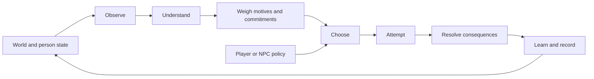

# Human Framework

**Resuming work? Start with the [handoff](HANDOFF.md): current versions, live release, latest player feedback, next priorities and safe reproduction commands.**

A simulation laboratory developing reusable components for situated human action and development, grounded in Islam with a **Sunni, Hanafi–Maturidi starting point**, informed by empirical research, and explicit about the difference between revelation, interpretation, evidence and engineering choices.

**2026-09-08 · App 0.11.0:** **[The camp](https://human.adamwhite.work/camp/)** carries your actual worksite into a ferry/rain chapter, then lets you return to the same people, supplies and unfinished work. Recovery is automatic while available; construction keeps progress and supports accepted handover. Five story slots preserve new and imported camps. [Release and production evidence](docs/release-0.11.md) · [All original experiments](https://human.adamwhite.work/games/). No LLM or API key is needed to play.

**Framework evidence:** the full [camp kernel and story comparison](docs/camp-comparison-reviewed.md) preserves simple-policy successes, the targeted restart correction and explicit migration/cost boundaries. All 29 reviewed cases replay on minimum Node 22. The [validator rival](docs/camp-validator.md) shows narrower replay-integrity benefits at higher cold-load cost; [immutable save caching](docs/camp-slots-contract.md) reduces ordinary update latency without changing bytes. Human usefulness and broader validation remain open. [Current handoff](HANDOFF.md).

**Earlier framework evidence:** [shared-plan comparisons](docs/service-plan-comparison.md) retain successful timed-request/visible-pump/handover alternatives, useful revisions and zero-unit failures. The two [Service Day priorities](docs/service-day-comparison.md) each protect the inlet and fully supply the clinic in nine conditions, totaling 18 runs; retained counterexamples identify the next coordination need. The [equal-learning body comparison](docs/body-isolation.md) isolates body constraints and retains simpler cases. The [coordination-helper probe](docs/coordination-probe.md) preserves exact behavior but fails its inclusive size gate; it stays private. Last Light selects a small notebook over the unpromoted [memory candidate](docs/observation-memory-probe.md). The earlier [0.6](docs/release-0.6.md) and [portable-kit](docs/mvp-evidence-2026-09-07.md) evidence remain dated records. Human/runtime 0.1.0/0.1.1, clock 0.1.0 and laboratory 0.3.0 stay frozen.

**Autonomous continuation:** the hourly Codex heartbeat advances executable milestones with independent Astra Ultra work and scoped Fable reviews. [Latest dispositions](docs/reviews/2026-09-08-earned-camp-review.md) · [Current handoff](HANDOFF.md). Human playtest, measured authoring-usefulness and physical-device gates remain open.

## Play

**[Choose a small game](https://human.adamwhite.work/games/).** The laboratory remains at [human.adamwhite.work](https://human.adamwhite.work/).

| Game | What you decide |
|---|---|
| [A Shared Promise](https://human.adamwhite.work/service-plan/) | Discuss a clinic plan, see Deniz’s answer, revise or withdraw your contribution, and distinguish promising from doing. |
| [Service Day](https://human.adamwhite.work/service/) | Protect the morning inlet and supply the clinic using the same two people and remaining supplies; make requests, see Deniz’s responses and manage carryover. |
| [Last Light](https://human.adamwhite.work/signals/) | Deliver the lens by canal or ridge; pay for observations, interpret delayed reports, recover when needed, and catch the launch if possible. |
| [Before the Water](https://human.adamwhite.work/watch/) | Repair the gate or open a diversion before the surge. Coordinate owned parts, lookout, recovery and partial work. |
| [Before the rain](https://human.adamwhite.work/commons-next/) | Pack supplies for households before the ferry or retain them for camp. A finite afternoon from an established worksite. |
| [Common Ground](https://human.adamwhite.work/commons/) | Gather, build, recover and agree on a shared project. Different jobs run concurrently; useful structures and supply caches persist. Optional solo setup. |
| [Pump Yard](https://human.adamwhite.work/shift/) | Order three pump repairs across an eight-hour shift, allocate one spare, build task experience, recover, and verify useful service. Single person; partial service earns points. |
| [The last water](https://human.adamwhite.work/courtyard/) | Carry and allocate scarce water between two households. Make requests and loans; independently accept or refuse exchanges. |
| [Courier Round](https://human.adamwhite.work/courier/) | Deliver six parcels with three bag slots. Choose routes, inspections and parcel order against different due times. Single person. |
| [Before departure](https://human.adamwhite.work/workshop/) | A short introduction: collect a tool, patch or replace one pump fitting, and test it before departure. Single person. |

Each game stores its own active run on the device. Saves and optional command replays are game-specific. Instructions are in the game; model notes and policy hints stay collapsed. The longer games are available locally at the same paths after this revision is checked out.
[Portable runtime and installation](docs/portable-runtime.md) · [Latest Common Ground feedback](docs/common-ground-feedback-2026-09-07.md) · [Earlier supplied play runs](docs/user-run-feedback-2026-09-07.md) · [Plain-language roadmap and evidence map](docs/roadmap.md) · [What is rejected or deferred](research/decision-status.md) · [Private source repository](https://github.com/adam0white/human-framework) · [Deployment workflow](docs/deployment.md)

For optional local development:

Requires Node.js 22 or later and a modern browser. From this directory:

```sh
npm start
```

Open [the optional local laboratory](http://127.0.0.1:4173). Choose a person and an action, or delegate with **Auto round**. **Run to end** plays out the current policy. Inspect the reasons and consequences; switch to **Researcher** for hidden conditions and random draws. Settings apply to a new run. Export a replay to preserve setup and choices, then import it to reconstruct the run.

Each preset allows 36 rounds of 20 simulated minutes. In Solo, one feasible example is to eat at observed hunger 60% when food remains, rest at fatigue 65%, and otherwise choose careful work. Seed 7 completes in 29 rounds with two failed repairs, six rests and two meals. This is an example, not an optimal or universally guaranteed strategy; faster successful strategies can use fewer meals.

| Small world | Decisions it exposes |
|---|---|
| Courier Crossing | Investigate uncertain conditions, choose a risky or careful contribution, manage fatigue, keep an announced promise |
| Repair Bench | Allocate scarce time between work, rest, food and task practice |
| Water Commons | Maintain a shared resource against consumption, prepare assistance and keep commitments |
| Solo Repair | Work, inspect, rest and practice alone; no promises, peers, assistance or relationship effects |

The original three laboratory presets remain configurations of the same two-person cooperative resource-production structure; Solo Repair isolates the personal processes with one actor. Their illustrations do not implement navigation, repair physics or hydrology. Before departure adds a host-owned object world through a separate boundary. Its `task-aware`, `planned-simple` and `greedy` controllers are authored by the host and do **not** call the lab Full policy. The shared human component currently supplies body, practice, observation and attempt timing, not the complete social/cognitive loop. [Integration record and remaining gates](docs/workshop-integration.md).

## The central loop



Every laboratory decision records these seven phases. The person's accessible view is separate from hidden world state. A player can override the ranking, while capacity determines whether exertion executes or recovery is required. Both request and execution are recorded. An executed task can fail and still yield task-specific practice; work replaced by recovery earns none. Intention is separate from outcome and never parsed to manufacture an effect. History is an audit log, not autobiographical memory.

This is an engineering loop, not an anatomy of the soul or a model of divine decree. Religious source distinctions guide the architecture and its boundaries; the MVP contains no fiqh evaluator, piety meter, spiritual-health score or calculation of divine acceptance. [Islamic foundations](research/islamic-foundations.md) preserves the positive theological treatment and attribution behind those boundaries.

## Run and extend

```sh
npm test
npm run package:runtime
npm run benchmark:commons
npm run simulate -- courier --seed 7
npm run simulate -- workshop --seed 31 --policy baseline --json /tmp/human-workshop-replay.json
npm run simulate -- solo --seed 7 --policy planned-simple
npm run benchmark -- --seeds 100 --start-seed 101 --json /tmp/human-benchmark-repeat.json
```

```js
import {createSimulation, getView, rankActions, step, exportReplay, replay} from './src/core/index.js';
import {getScenario} from './src/scenarios/index.js';

const start = createSimulation(getScenario('courier'), {seed: 7});
const view = getView(start, 'amina');
const alternatives = rankActions(view, {modules: {body: false}});
const next = step(start, {
  type: 'act', actorId: 'amina', actionId: 'observe',
  intention: 'Seek better evidence'
});
const restored = replay(exportReplay(next));
```

The ranking override only inspects an alternative policy; it does not mutate the run. Candidates sort by `selectionTier`, then additive score, then action ID. Actor order is stable and serial within each lab round. Current scenarios require dimensionless `goalUtility`: converting physical units rescales progress/output/target/consumption, not that value. Full's deadline term is a utility heuristic, not multistep planning.

Replay uses the embedded scenario, commands and matching engine: frozen 0.1.0 and 0.2.0 remain available for read-only historical inspection, while the current laboratory creates 0.3.0 runs. Unsupported versions are rejected. Replays include hidden setup. Laboratory modules are in `src/core`, historical execution in `src/legacy`, presets in `src/scenarios`, and browser adapters in `web`. The narrower component is `src/human`: `index.js` preserves version 0.1.0 for existing games, while `v0.1.1.js` supplies the current portable package. Workshop (`src/games/workshop.js`) was the first consumer of 0.1.0; the independently authored maintenance/watch example now exercises the package. All hosts own their resources, task outcomes and completion rules. Common Ground uses the additive `src/runtime` event clock and its own canonical minute advancement; the browser is a clock driver. The local package exports the human component and clock, not the laboratory Full policy. The courtyard social responses are authored in that host; they have not been extracted into a shared social API. A new shared mechanism needs an explicit model change and validation.

## What the experiments found

The 0.3.0 artifact uses 100 paired seeds, 101–200. Full and planned simple complete 100/100 in every lab preset; greedy completes 99/100 in Courier and Solo and 100/100 in Repair and Commons.

| Mean simulated rounds | Full | Planned simple | Greedy baseline |
|---|---:|---:|---:|
| Courier Crossing | 25.70 | 25.39 | 28.40 |
| Repair Bench | 23.29 | 23.00 | 25.87 |
| Water Commons | 18.51 | 18.40 | 19.68 |
| Solo Repair | 22.03 | 21.59 | 23.15 |

**Planned simple is slightly faster than Full in all four sample means**, although each paired uncertainty interval includes zero. It also finishes with less fatigue/hunger and uses more food. Full keeps an additional promise in Courier and Repair and inspects Courier conditions. Those differences need their own gameplay and behavioral tests; faster completion alone is not the complete objective.

The lab's mandatory recovery still helps greedy work requests. Full incurs 0.22 compulsory recoveries per Commons run and none in the other presets; planned simple incurs none. Disabling relationships changes no objective outcome in these defaults. All **400 structural null pairs** match in the **4,400-run** benchmark. The [current report](docs/benchmark-report.md) records paired intervals, costs, ablation limitations and source identities. The separate host games are not included in that lab comparison. Their controllers, metrics and seed blocks are reported separately in the [milestone record](docs/release-0.4.md).

The [archived 0.2 report](docs/history/benchmark-report-0.2.0-2026-09-07.md) preserves the capacity/workload repair comparison; the [0.1 report](docs/history/benchmark-report-0.1.0-2026-09-07.md) retains the fatigue loophole and inadequate recovery slack. Tests and browser QA verify software behavior and playable paths, not human behavior or theological adequacy. See the [capacity correction](docs/capacity-fix.md) and [MVP record](docs/mvp-status.md) for earlier verification history.

## Research and model records

| Document | Purpose |
|---|---|
| [Ongoing-play prior art](research/ongoing-play-prior-art.md) | WazHack and Universal Paperclips precedents, time controls, persistent productive capacity and progression traps |
| [Learning through work](research/learning-through-work.md) | Evidence for and against learning from unsuccessful attempts, and a reproducible matched-exposure model probe |
| [Model reference](docs/model-reference.md) | Implemented equations, units, parameter status, update order and API boundaries |
| [Coverage ledger](docs/coverage-ledger.md) | Implemented proxies, missing faculties, deferred modules and next discriminating experiments |
| [Research decision status](research/decision-status.md) | Rejected formulations versus deferred domains, with explicit conditions for returning |
| [MVP specification](docs/mvp-spec.md) | Accepted scope and concrete contracts |
| [Historical source audit](research/historical-source-audit.md) | All 63 bibliography entries from the two historical reports, targeted verification and 32 mechanism decisions |
| [Historical source inventory](research/historical-sources.json) | Machine-readable provenance, access status and source hashes; 43 entries remain unchecked leads after the [targeted follow-up](research/learning-source-followup-2026-09-07.md) |
| [Prior art](research/prior-art-mvp.md) | The Sims, Versu, social and cognitive architectures, adaptive information, pacing and macro-model boundaries |
| [Experiment design](research/mvp-experiment-design.md) | Independent tests aimed at rejecting unhelpful complexity |
| [Framework proposal](docs/framework-proposal.md) | The broader research direction; proposed faculties are not all implemented |
| [Empirical models](research/empirical-models.md) | Scientific candidates and competing explanations |
| [Architecture alternatives](research/architecture-alternatives.md) | Alternative computational approaches and rejection experiments |
| [Source method](research/source-method.md) | Claim types, interpretation and evidence admission |
| [Earlier research review](docs/review-record.md) | Corrections to the initial synthesis, before implementation |

The historical reports are evidence to examine. Their instructions, coefficient tables and “production-ready” title do not govern this implementation. User-authored aims are kept distinct from inherited LLM proposals. The project remains small enough to inspect and to replace mechanisms when a better model earns its place.
