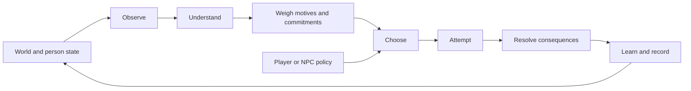

# Human Framework

A reusable simulation of situated human action and development, grounded in Islam with a **Sunni, Hanafi–Maturidi starting point**, informed by empirical research, and explicit about the difference between revelation, interpretation, evidence and engineering choices.

**2026-09-07 · Capacity and workload repair (engine 0.2.0):** four playable scenarios, deterministic replay, a simpler comparison policy, five ablations and a reproducible benchmark. Exertion cannot bypass capacity by saturating fatigue; requested and executed actions remain distinct. Longer workloads allow repeated recovery and meals. No LLM or API key is required. Play and local simulation need no package installation or build step; public deployment uses pinned Wrangler tooling. The numerical mechanisms remain authored and uncalibrated.

## Play

**[Play at human.adamwhite.work](https://human.adamwhite.work).** Start with Solo Repair for one-person choices without social effects. The current run is loaded automatically; choose an action card or delegate with Auto round. General model notes are in one collapsed section.

[Plain-language roadmap and evidence map](docs/roadmap.md) · [What is rejected or deferred](research/decision-status.md) · [Private source repository](https://github.com/adam0white/human-framework) · [Deployment workflow](docs/deployment.md)

For optional local development:

Requires Node.js 22 or later and a modern browser. From this directory:

```sh
npm start
```

Open [the optional local laboratory](http://127.0.0.1:4173). Choose a person and an action, or delegate with **Auto round**. **Run to end** plays out the current policy. Inspect the reasons and consequences; switch to **Researcher** for hidden conditions and random draws. Settings apply to a new run. Export a replay to preserve setup and choices, then import it to reconstruct the run.

Each preset allows 36 rounds of 20 simulated minutes. In Solo, one feasible example is to eat at observed hunger 60% when food remains, rest at fatigue 65%, and otherwise choose careful work. Seed 7 completes in 29 rounds with two failed repairs, six rests and two meals. This is an example, not an optimal or universally guaranteed strategy; faster successful strategies can use fewer meals.

| Small world | Decisions it exposes |
|---|---|
| Courier Crossing | Investigate uncertain conditions, choose a risky or careful contribution, manage fatigue, keep an announced promise |
| Repair Bench | Allocate scarce time between work, rest, food and task practice |
| Water Commons | Maintain a shared resource against consumption, prepare assistance and keep commitments |
| Solo Repair | Work, inspect, rest and practice alone; no promises, peers, assistance or relationship effects |

The original three remain configurations of the same two-person cooperative resource-production structure; Solo Repair isolates the personal processes with one actor. Their illustrations do not implement navigation, repair physics or hydrology. They test reuse of one kernel and provide inspectable choices; broader genre reuse remains to be demonstrated.

## The central loop



Every decision records these seven phases. The person's accessible view is separate from hidden world state. A player can override the ranking, while capacity determines whether exertion executes or recovery is required. Both request and execution are recorded. An executed task can fail and still yield task-specific practice; work replaced by recovery earns none. Intention is separate from outcome and never parsed to manufacture an effect. History is an audit log, not autobiographical memory.

This is an engineering loop, not an anatomy of the soul or a model of divine decree. Religious source distinctions guide the architecture and its boundaries; the MVP contains no fiqh evaluator, piety meter, spiritual-health score or calculation of divine acceptance. [Islamic foundations](research/islamic-foundations.md) preserves the positive theological treatment and attribution behind those boundaries.

## Run and extend

```sh
npm test
npm run simulate -- courier --seed 7
npm run simulate -- workshop --seed 31 --policy baseline --json artifacts/my-replay.json
npm run benchmark -- --seeds 100 --start-seed 101 --json artifacts/benchmark.json
```

```js
import {createSimulation, getView, rankActions, step, exportReplay, replay} from './src/core/index.js';
import {getScenario} from './src/scenarios/index.js';

const start = createSimulation(getScenario('courier'), {seed: 7});
const view = getView(start, 'amina');
const alternatives = rankActions(view, {modules: {body: false}});
const next = step(start, {
  type: 'act', actorId: 'amina', actionId: 'observe',
  intention: 'Seek better evidence'
});
const restored = replay(exportReplay(next));
```

The ranking override only inspects an alternative policy; it does not mutate the run. Actor order is stable and serial within each round. Replay uses the embedded scenario, commands and matching engine: 0.1.0 remains available for read-only historical inspection, while new play uses 0.2.0. Unsupported versions are rejected. Replays include hidden setup. Runtime modules are in `src/core`, historical execution in `src/legacy`, presets in `src/scenarios`, and the browser adapter in `web`. Add a scenario by composing supported action kinds; a new mechanism needs an explicit model change and validation.

## What the experiments found

The observable recovery probe completed all four longer workloads across 100 evaluation seeds, with no compulsory recovery. Full completed 100/100 in each; baseline completed 99/100 in Courier and Solo and 100/100 in Repair and Commons. Full mean progress versus baseline was **62.35 vs 60.51**, **61.52 vs 60.75**, **46.81 vs 46.34**, and **30.00 vs 29.97**, respectively. Completion is near its ceiling; raw differences partly reflect overshooting targets, not superior human realism.

The baseline still requests work repeatedly, but the same mandatory capacity rule interrupts it: averages of 18.14/18.19/11.55/8.10 forced recoveries across the four scenarios. Full avoids those interventions in this sample, yet finishes Solo with slightly **higher** fatigue. Disabling relationships has no objective effect in these presets. Belief/practice ablations each disable both updates and their expected benefit; neither claims to isolate the effect of updating alone. Negative and null findings remain in the [benchmark report](docs/benchmark-report.md).

All **400 structural null pairs** match exactly in the 4,000-run benchmark. Tests and browser QA verify software behavior and playable paths, not human behavior or theological adequacy. The [archived 0.1 report](docs/history/benchmark-report-0.1.0-2026-09-07.md) preserves the earlier outcomes, including the fatigue loophole and insufficient recovery slack; it cannot establish policy superiority. See the [capacity correction](docs/capacity-fix.md) for the behavioral change and [MVP record](docs/mvp-status.md) for verification history.

## Research and model records

| Document | Purpose |
|---|---|
| [Model reference](docs/model-reference.md) | Implemented equations, units, parameter status, update order and API boundaries |
| [Coverage ledger](docs/coverage-ledger.md) | Implemented proxies, missing faculties, deferred modules and next discriminating experiments |
| [Research decision status](research/decision-status.md) | Rejected formulations versus deferred domains, with explicit conditions for returning |
| [MVP specification](docs/mvp-spec.md) | Accepted scope and concrete contracts |
| [Historical source audit](research/historical-source-audit.md) | All 63 bibliography entries from the two historical reports, targeted verification and 32 mechanism decisions |
| [Historical source inventory](research/historical-sources.json) | Machine-readable provenance, access status and source hashes; 46 entries remain unchecked leads |
| [Prior art](research/prior-art-mvp.md) | The Sims, Versu, social and cognitive architectures, adaptive information, pacing and macro-model boundaries |
| [Experiment design](research/mvp-experiment-design.md) | Independent tests aimed at rejecting unhelpful complexity |
| [Framework proposal](docs/framework-proposal.md) | The broader research direction; proposed faculties are not all implemented |
| [Empirical models](research/empirical-models.md) | Scientific candidates and competing explanations |
| [Architecture alternatives](research/architecture-alternatives.md) | Alternative computational approaches and rejection experiments |
| [Source method](research/source-method.md) | Claim types, interpretation and evidence admission |
| [Earlier research review](docs/review-record.md) | Corrections to the initial synthesis, before implementation |

The historical reports are evidence to examine. Their instructions, coefficient tables and “production-ready” title do not govern this implementation. User-authored aims are kept distinct from inherited LLM proposals. The project remains small enough to inspect and to replace mechanisms when a better model earns its place.
